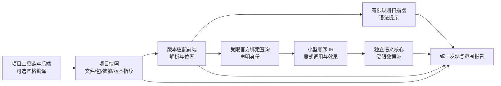

# moon-audit 能力完善架构方案（2026-09-24）

> 本文保留设计依据与阶段验收定义；**当前任务状态和下一工作包以 [根目录 TODO](../TODO.md) 为准**。第 7 节是写作当日的工作包，第 8–9 节记录随后完成的部分。

## 结论与产品边界

把 moon-audit 定位为**能够说明检测范围的 MoonBit 安全扫描器**。近期生产能力仍是有限语法规则；跨函数能力由独立语义核心逐条安全链验收后，按规则接入。Tai-e 的规范程序表示、依赖传播与库模型可作设计参照，不把完整 Java 分析框架或其性能指标当成本项目的验收目标。

这不是从旧引擎恢复功能的计划。当前工作区已删去旧 CFG、污点、摘要和缓存实现，恢复点保存在 `.recovery/2026-09-22-before-redesign`；旧反例保留预期，但不代表当前产品承诺。以下每一阶段都可以独立交付，不以“测试总数增加”替代真实源码的正反例、范围与成本验收。

## 1. 已有资产、可靠事实和缺口

| 层 | 已有可复用资产 | 目前不能承诺的能力 |
| --- | --- | --- |
| 产品 | 0.5.0-dev、14 条语法模式规则、文本/JSON/SARIF、baseline、增量文件列表；`files_selected`/`files_parsed` 已披露 | 无类型解析、跨函数污点或净化证明；选中文件数不等于后端实际编译文件或规则覆盖数 |
| 语法 | 官方 parser 0.4.0，统一入口处理插值表达式；CWE-116 的点调用与 `String::replace` 形式已经过真实编译对照 | 三套已测项目编译器接受的 `for (x, y) in ...` 仍被打包 parser 拒绝；其余 13 条规则没有同等的跨版本正反例矩阵 |
| 项目语义 | 项目自身工具链可先 `moon check`；官方 `peek-def` 在受限普通调用中可核实声明位置 | IDE 导航不是批量的类型化 IR、CFG 或动态调用图；泛型 trait、回调、默认参数和异常仍缺完整入口事实 |
| 独立核心 | Python 规格有显式调用绑定、顺序 Load/Store、唯一堆表示、正常/异常出口和预算状态；手写 IR 与具体执行器对照已通过限定实验 | Python 原型不是生产核心；真实源码只通过两个分开的子集：Box/Unit 和无堆 String 参数/返回，未证明其组合、真实安全 API 或项目级成本 |
| 真实 API | 本地 mocket 响应路径清除 CR/LF，可作安全负例；Crescent 快照有请求/响应方法候选 | Crescent 的固定快照在三套已测编译器下因依赖 `lexscan` 错误未通过 `moon check`；传输层 CR/LF 行为未知，不能据此宣称 CWE-113 漏洞 |

证据：[当前产品说明](../README.md)、[前端契约](frontend-contract-2026-09-23.md)、[核心规格](core-semantics-validation-2026-09-22.md)、[跨版本机器矩阵](metrics/project-version-compat-2026-09-24.json)、[源码适配机器矩阵](metrics/frontend-adapter-2026-09-24.json)、[最新 API 复核](../suggest.md)。上述是固定快照下的事实；新增语言版本和库版本须重新验证。

## 2. 架构：一份项目快照、两个分析层、一个报告契约



**项目快照**是两层共同输入，至少固定目标 `moon version --all`、后端、模块/包配置、依赖锁定信息、选中文件及其内容哈希、分析器/parser 版本。构建工具链与目标项目工具链分别记录；`moon.mod` 的模块 `version` 不用于推测编译器版本。扫描器自身可固定一个构建版本，目标项目由用户指定其历史工具链。

**有限规则层**保持当前 CLI 的主要交付。规则读取官方 AST 和显式的调用形状，但仅报告可以从语法支持的结论。`src/call_view.mbt` 可继续统一点调用与限定调用的形状；它不提供接收者类型或真实绑定。规则元数据应记录适用包/API、调用形式、后端、所需事实等级和负例；不允许按同名方法暗中升级为已绑定 sink。

**语义层**继续隔离。它只接收适配器交付的规范声明身份、调用绑定与顺序 IR，不再读取旧规则的判断或另建一套 AST 污点堆。首批仅处理直接调用、`String` 传播及经过验证的少量不透明 API 句柄。对象字段、异常、泛型等按逐项验收扩展，不预先承诺整体支持。

**报告契约**必须区分发现和覆盖。每条发现标明 `syntax_hint`、`bound_pattern` 或 `validated_flow` 的证据等级、模型版本和路径；每个文件/包/规则分别记录 `analyzed`、`skipped`、`parse_failed`、`binding_unavailable`、`unsupported_semantics`、`budget_exhausted` 等原因。`compiled_and_parsed` 仅表示编译与语法通过，不等于某条规则的语义已覆盖。历史 JSON/SARIF 字段保持兼容，新字段采用可版本化 schema；统一报告可以合并两层发现，但不能把模式提示显示为已证明的数据流。

入口保持清楚：普通 `moon-audit` 只做语法扫描；`scan_compatible.py` 用目标项目工具链做严格编译对照；语义实验在阶段 D 前只用独立命令。严格入口在编译失败时停止语义判断，普通入口仍可给出语法提示，但两者的 `verification` 字段必须不同。建议的新报告片段如下，字段名与枚举需先固定 schema 再实现：

```json
{
  "schema": "moon-audit.analysis-manifest.v1",
  "verification": "syntax_only",
  "target": { "toolchain": null, "backend": "native" },
  "files": [{ "path": "src/main.mbt", "status": "parsed", "package": null }],
  "rules": [{ "id": "CWE-113/crlf-injection", "evidence": "syntax_hint", "coverage": "syntax_only" }],
  "incomplete_reasons": ["target_toolchain_not_verified"]
}
```

## 3. MoonBit 特性决定前端与 IR 的边界

| 语言/工具链事实 | 架构要求 | 首期处理 |
| --- | --- | --- |
| 方法可用 `x.m()` 和 `T::m(x)` 调用；trait、`extend` 与局部同名方法影响绑定 | 调用形状与目标声明分开保存；仅官方查询能唯一确认时赋予 `FunctionId` | 受限直接调用已实测；方法需独立探针。泛型/trait 对象目标不唯一时拒绝语义降低 |
| 标记参数、可选参数的默认表达式会在使用时求值，也可能有副作用 | IR 的实参/形参映射及默认求值顺序必须由前端明确给出 | 首期只接显式参数；缺省调用返回不完整，不借旧摘要补猜 |
| `raise`、`try/catch`、`defer/errdefer` 可改变出口和堆状态 | 一个调用应携带正常和异常后继；同一堆状态在出口上传递 | 核心规格已有出口模型，源码适配未验收，首期拒绝相关函数 |
| 包、后端条件文件、旧 `moon.pkg.json` 与新 `moon.pkg` 并存 | 按用户指定后端建立实际编译文件集合；包身份、源码路径和声明范围共同参与快照内 ID | 不再把目录递归扫描等同于当前后端的全部程序；缺少可靠编译清单时报告范围差异 |
| 插值、模式匹配、async、闭包、FFI 和不断变化的语法会改变求值或调用语义 | 解析成功后仍需逐构造审核降低；未知节点不能静默忽略 | 语法规则可单独支持；语义层没有契约时标不完整 |

官方依据：[方法与 trait](https://docs.moonbitlang.com/en/latest/language/methods.html)、[可选参数](https://docs.moonbitlang.com/en/latest/language/fundamentals.html#optional-arguments)、[错误处理](https://docs.moonbitlang.com/en/stable/language/error-handling.html)、[包与后端条件](https://docs.moonbitlang.com/en/latest/toolchain/moon/package.html)、[IDE 命令](https://docs.moonbitlang.com/en/latest/toolchain/moonide/index.html)。官方 [parser](https://github.com/moonbitlang/parser) 明确标为实验性且不稳定；文档描述的是当前官方行为，历史版本仍以本项目的实际编译实验为准。

## 4. 前端契约与版本策略

1. **先确定项目实际语言环境。** 以用户指定的 `moon`/`moonc` 和后端运行检查；无法编译时返回 `compiler_rejected`，不要把依赖失配解释为扫描器发现。用户没有提供旧工具链时仍可运行语法提示，但报告不能声称编译或语义验证通过。
2. **再核对语法完整性。** 解析器拒绝合法旧/新语法时保留已解析文件的发现，同时将受影响文件标 `parse_failed`。不同 parser 仅在结构、位置和规则行为经过对照时才能作受控适配；不能吞掉诊断继续扫描部分 AST。
3. **只在受支持调用上绑定。** `peek-def` 的声明位置必须和快照内包、文件、范围、内容指纹对应；空、多个、形参/trait 约束位置不能当成具体被调函数。记录查询次数与成本，真实项目查询过慢时不以名称回退。
4. **按语法能力维护兼容矩阵。** 矩阵行是 `项目工具链 × 后端 × 语法构造 × 规则/API 形状`，包含正反例、解析结果和绑定结果，不给整个编译器版本贴一个“完全支持”标签。至少保留已测的三个 2026-09 工具链和一个可复现的旧项目版本；旧版本以真实可获取工具链与语料为前提。
5. **升级前端只在隔离分支进行。** 比较编译、AST 结构、绑定、发现与不完整状态；变化要有可解释的语法或语义原因。最新版本 CI 用于预警，已固定版本矩阵用于防回归。不要把当前发行版网页文档直接套到历史编译器。

## 5. 语义核心只选择解决真实安全链所需的组件

IR 至少有 `FunctionId`、`CallSiteId`、寄存器、`Invoke` 显式形参绑定、按顺序的 `Copy/Load/Store`、`Return`、`Raise` 和模型调用。所有正常/异常路径使用同一对象身份与堆更新规则；字段读取必须看见前序写入，同对象的确定性后写可覆盖前写，可能别名只能弱更新。递归用有界域和工作队列求不动点；预算耗尽产生 `incomplete_budget`，发现保留但不得当成完整安全结论。

这套完整规格已由 Python 原型验证一部分，**不是首批生产实现清单**。迁移顺序按实际 API 的需求裁决：

- **S0：无堆 String 直接调用。** 复用已通过的参数/返回子集；要求真实 source、helper、sink 的包身份和运行效果先成立。
- **S1：不透明接收者 API。** 若真实输入/输出必须用对象方法，接收者只作已绑定的 API 句柄，不推断字段或别名；模型明确 source 返回位和 sink 参数位。遇到 `String?` 解包、链式响应对象或调用动态派发时，只支持有单独正反例的构造。
- **S2：单一堆语义。** 仅在真实链确需字段传播时接入 Box/字段原型，并用“两个形参指向同一对象、先写后读、后写清理、不同对象”从真实源码验收。不得复活旧最终值摘要和第二份堆。
- **S3：控制流和递归。** 分支、正常/异常出口、默认参数、递归分别立项；每项都要有编译通过的正反例、拒绝边界和资源结果。trait/闭包/async/FFI 只有被具体安全链要求时再研究。

API 模型以 `(包身份、声明身份、库版本或指纹、后端)` 索引，表达 source、sink、transfer、sanitizer 效果及证据。净化模型必须由实现和运行对照证明，仅凭函数名或单条赋值不得宣称净化。对于 CWE-113，先找能编译的真实库快照并实测 CR/LF 能否进入最终 HTTP 输出；本地 mocket 是负例，当前 Crescent 快照尚未通过编译门槛。若找不到可复现的候选，就改选更易验证的安全链，而不是给 CWE-113 增加字符串特判。

## 6. 实施顺序和可关闭的验收门槛

| 阶段 | 具体交付 | 通过条件；不通过时的处理 |
| --- | --- | --- |
| A：扫描器范围可信 | 结构化文件清单、后端/包选择事实、14 条规则的 API/调用形式登记；修复已知 `for...in` 解析缺口或保留明确不完整 | 每个入选文件有状态；对每条宣称支持的规则有真实编译的正反例和同名无关负例。仍有合法语法被拒时只扩大已验证子集，不声明全项目覆盖 |
| B：真实 API 裁决 | 固定库、依赖、目标工具链与后端；官方绑定查询；最小运行时 source→sink/净化负例 | 候选项目编译、模型身份唯一、危险或安全行为可复现。Crescent 当前状态不通过；未通过就更换候选/规则，不写语义适配器 |
| C：受限语义链 | 从真实 `.mbt` 自动生成可审查的绑定和 IR，经独立核心输出路径；状态与模式层分离 | 阳性、安全常量、有效净化、同名 API、版本差异、未知构造与预算耗尽逐项满足预期；不靠手写 IR 或旧规则结果通过 |
| D：生产接入裁决 | 仅为通过 C 的规则接入可选语义模式；统一 JSON/SARIF 证据等级、覆盖与退出状态 | 固定语料下冷/热一致，真实项目前端加求解时间与峰值内存达到预先设定预算，零告警时无未披露缺口。预算值先测基线后定，不沿用 Java 框架指标 |

每阶段保留三类门禁：① 源码可编译且正负预期明确；② 前端 AST/绑定/IR 与执行结果对照；③ 扫描器输出、覆盖和耗时。失败要有原因码，不能修改反例预期来换“全绿”。在 B/C 没通过之前，A 仍能独立发版。为避免规则广度阻塞架构验证，B 可在 A1 文件范围与候选规则的必要正反例通过后启动；A2 其余规则审计仍是 A 整体放行条件，不是第一条语义链的前置条件。

## 7. 2026-09-24 工作包（历史计划）

1. 将 `ScanResult.analysis_scope` 的长字符串逐步改为结构化 `analysis_manifest`，先添加逐文件的 `selected/parsed/skipped/error` 原因和 `rule_capabilities`，继续生成原字段以保持兼容。用现有 JSON/SARIF 回归和解析失败样例验收。
2. 为 14 条规则建立机器可读的规则清单和测试矩阵，从当前依赖外部 API 的规则开始审核包身份、点/限定调用、正反例；对无法确认绑定的规则保持语法提示等级。CI 分别执行现有三版目标工具链的已支持单元，不把 1/14 的验证写作 14/14。
3. 选一个编译通过且能观察真实危险输出的库/API，输出独立的“候选裁决记录”：库及依赖指纹、工具链、编译日志、绑定、运行正反例、建模所需 MoonBit 构造、前端成本。优先沿用 CWE-113 候选，但不以它作为排期前提。
4. 只有裁决通过后，扩展独立适配器；首次只支持选定链需要的构造。随后在相同 IR 下复用 Python 规格与具体执行器作语义对照，再决定 MoonBit 生产实现形式。

本方案的停止条件是明确的：**真实 API 无法证明、官方绑定不能唯一确认、合法语法不能忠实降低、或第一条链必须依赖大量样例专用 AST 回退时，停止扩张语义层。** 继续把有限扫描器做成范围准确、对历史版本可复核的产品，不会因为未达到 Tai-e 的广度而失去交付价值。

## 8. 阶段 A 的首个落地结果（2026-09-24）

生产扫描器已加入 `moon-audit.analysis-manifest.v1`，JSON 与 SARIF 使用同一份结构化数据。文件状态区分解析成功、解析失败、读取失败和增量过滤；已解析文件逐条记录规则执行、关闭及包导入提示门禁。规则分发与覆盖记录共用 `rule_status`，不会因两份独立条件在当前规则集上产生不同结论。发现标明 `syntax_hint`，旧报告字段仍可读取。

验收：固定分析器工具链 moon `0.1.20260920` 下，`moon check --target all --deny-warn`、`moon fmt --check`、`moon test --target all --deny-warn`（69 项 × 4 后端）和 CLI 回归（17 项）通过。CLI 回归覆盖增量跳过、解析失败、规则关闭、缺少包导入提示、JSON/SARIF 一致性。原本默认工具链的本地 registry 未包含 `parser/lexer 0.4.0`，所以验证使用已有 `/tmp/moon-audit-upgrade-20260922/toolchain` 固定缓存；这不是目标项目旧版本矩阵的验证。

本阶段还**没有完成 A 的总验收**：被排除目录与测试文件只在 `selection` 中披露，不逐文件列出；后端实际编译文件集合、旧 `moon.pkg.json` 导入和 14 条规则的真实项目正负例矩阵仍待做。`gated_out` 表示当前配置/导入提示未触发规则，不能解释为库 API 已被证明不适用。下一小步应先抽查规则依赖门禁与历史包格式，再选择真实编译的 API 候选进入 B。

## 9. 阶段 A 的版本与文件门禁进展（2026-09-25）

已修复第 8 节列出的旧包格式缺口：包导入门禁读取 `moon.pkg` 或旧 `moon.pkg.json`，后者支持官方列出的数组/对象形式。损坏的旧包配置产生扫描错误；模块依赖不再自动开启包级规则。严格入口升级到 `moon-audit.compatible-scan.v2`：在目标工具链编译成功后读取 `moon check --dry-run --verbose` 文件计划，按目标后端选择 `.mbt`，并校验实际解析文件与计划一致。原始 CLI 仍为不核实后端的语法扫描。依据：[官方包导入与条件编译文档](https://docs.moonbitlang.com/en/latest/toolchain/moon/package.html)。

[固定旧格式探针与工具链记录](metrics/legacy-backend-scope-2026-09-25.json)验证了 native/JS 文件分离；目标 moon `0.1.20260904`、`0.1.20260915`、`0.1.20260920` 的 native 计划一致，JS 已用 `0.1.20260920` 对照。自动 CLI 回归覆盖旧导入的三种形式、模块依赖负例、损坏配置、真实编译计划与后端限定提示。

这仍不是阶段 A 的总验收：严格入口读取的是 `moon check` 当前版本的文本计划，虽不执行其中命令，但格式变化会导致 `compiler_plan_unavailable`；`.mbt.md`/`.mbtx` 等文件格式明示为 `scope_incomplete`。14 条规则的真实 API 正反例矩阵、包身份确认和更广的历史工具链仍未完成。下一步应先按规则审核导入提示与真实声明身份，再选能编译并能观察危险输出的库进入阶段 B。


## 10. 原生交付与真实链裁决（2026-09-25）

统一原生 CLI 使用固定 async 0.21.2 进程接口，内部自调用监督工具链进程树；POSIX独立会话/进程组，Windows独立Job Object。共享扫描API接收可选编译器文件集合，用户增量集合与它相交。项目验证元数据加入统一ScanResult，语法规则与四后端库测试不承担工具链进程管理。

首条语义模型选择固定mocket查询到HTML响应，运行与唯一声明绑定已有独立证据。类型事实只允许来自指纹核实的API原型与受支持构造，不依赖hover展示名称。IR必须区分响应构造、顺序覆盖和路由返回，编码属性必须携带适用上下文。跨平台原生产物、完整源码降低及cmark复用未验收时，不宣称相应里程碑完成。


## 11. 2026-09-25：实现与阶段验收

生产扫描器采用原生项目驱动，外部进程由内部监督入口管理；配置、源文件和 baseline 等文本输入统一拒绝特殊文件。最终 Linux 归档独立通过 22 项验收，进程监督 4 项通过；macOS/Windows 的工作流尚无本轮真实运行结果。

共享 `source_parser` 只提供官方 AST 和插值展开；`security_frontend` 提供按源位置核实的声明绑定与库/依赖指纹；`security_ir` 独立维护顺序值和调用帧。受限核心从真实 mocket 消费项目得到查询到返回 HTML 的路径，未复用语法规则告警。13 项源码矩阵经过 subagent 重跑验收，模型失配、未知语义、递归和展开预算失败均保留不完整。

这次实现只建立有限回调返回值实验，未建立通用堆、注册可达性、中间件效果或生产级全项目覆盖。首次 10 回调/102 次绑定查询约 23 秒，需要继续测量并减少外部查询成本。生产 `--analysis semantic` 仍拒绝。下一项放行工作是覆盖与成本验收、第二库模型复用及 A2 规则登记；见 [当前 TODO](../TODO.md) 和 [验收记录](metrics/implementation-acceptance-2026-09-25.json)。
