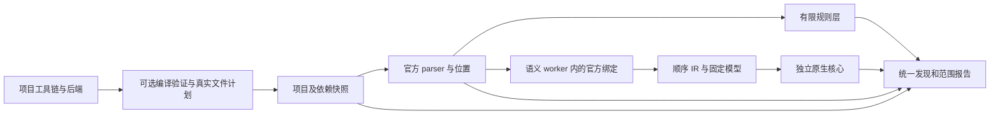

# moon-audit 能力完善架构方案

原方案日期：2026-09-24；实现状态更新：2026-09-25。当前任务清单见 [TODO](../TODO.md)，用户入口见 [README](../README.md)。本文明确区分已实现的有限能力、尚待完成的发布验收和未来研究。

## 1. 产品目标与本阶段结论

为下载源码自行编译或下载原生二进制的用户，提供能够解释检测范围的 MoonBit 安全检测工具。扫描自己的项目和第三方源码同等重要。分析器构建工具链固定，待检测项目工具链由用户选择；语言迭代导致的编译、解析或模型缺口分别报告。

**A–D 的有限实现已形成闭环，并通过 Linux 本地生产入口验收。** 默认是有限语法扫描；可选语义模式只覆盖明确声明的 mocket `.get` 回调及经核实的 cmark 模型。三平台最终 CI 和归档发布仍待验收，不把工作流存在等同于平台通过；[草稿 PR #1](https://github.com/I3eg1nner/moon-audit/pull/1)尚未合并发布。

Tai-e 提供可借鉴的规范身份、显式调用绑定、依赖与库模型设计。完整 Java 对象分析、动态调用图、通用堆和框架规模不作为本阶段验收目标。删减前的 CFG/摘要/污点实现没有恢复；`.recovery/2026-09-22-before-redesign` 和旧反例保留研究价值，不能算当前生产能力。

## 2. 已实现架构



| 组件 | 当前责任 | 不承担的推断 |
| --- | --- | --- |
| `project_driver` | 原生进程监督、目标编译检查、计划解析、快照、预算与 worker 生命周期 | 不以分析器版本推测项目版本，不安装或升级项目依赖 |
| 语法前端与扫描器 | 对选中文件完整解析，执行启用规则，输出逐文件/规则状态 | 不在解析错误后把部分 AST 算作完整覆盖 |
| `rule_registry` | 同一登记控制 14 条规则的默认策略、分发、导入门控和机器能力说明 | 导入名称、方法名称不建立真实 API 身份 |
| `security_frontend` | 官方唯一声明绑定、模型/依赖指纹核实、受支持构造降低为顺序 IR | 不通过 hover 类型名猜内建 String，不回退旧 AST 污点规则 |
| `security_ir` | 统一值身份、参数/返回、局部覆盖、来源路径、编码上下文和最终 responder 计算 | 没有通用对象堆、别名、分支合并或项目级注册可达性 |
| 生产报告 | 合并语法和语义发现，保留证据等级、声明范围、未知与预算失败 | 不把零发现、编译通过或单条完整路径解释为项目安全 |

默认扫描不要求项目工具链。`--verify-project` 在同一指定工具链下执行 `moon check --frozen` 和文件计划；可能写构建缓存。语义模式强制验证，并在独立受监督 worker 内再次核对编译与快照。

## 3. 范围与版本契约

1. **构建版本与目标版本独立。** 分析器固定 moon `0.1.20260920` / moonc `v0.10.14+7d59c7ec9` / parser `0.4.0`；目标版本来自实际工具链查询。`moon.mod` 的 `version` 是模块版本。工具链归档的安装 ID 是编译器版本，而非 moon 日期版本。
2. **实际编译计划决定选源。** native、js、wasm、wasm-gc 分别验证；不能把新版配置语义自行套用到旧编译器。计划格式无法解释、文件不匹配、空编译集合或未支持文件格式都保留不完整状态。
3. **编译与解析分别验收。** 项目在其工具链下有效，并不保证打包 parser 能处理旧/新语法；失败文件不计为 `files_parsed`，其他文件已有发现仍保留。
4. **身份只在已核实调用上建立。** 定义位置必须对应文件、范围、库及依赖指纹。空/多目标、同名本地函数、约束位置、未知模型不冒充真实安全 API。
5. **按能力维护矩阵。** 单位是项目快照 × 工具链 × 后端 × 语法/调用形式 × 模型；不声称某个版本“全部支持”。

[2026 三版四后端矩阵](metrics/native-version-matrix-2026-09-25.json)提供 12 组有限选源对照。[真实 2025 QuickCheck](../experiments/historical_project/README.md)在 moon `0.1.20251030` / moonc `v0.6.30` 下编译通过，原始 55 个文件未改；30 个源码选择一致，但只有 16 个被当前 parser 解析，14 个失败，严格扫描返回 `scope_incomplete` / 2。这个结果验证旧工具链接入及诚实失败，不证明旧语法完整兼容。

`for (x, y) in ...` 的新语法缺口同样保留显式不完整。后续适配必须重新对照 AST、位置、绑定、规则结果与诊断；不为每个工具链补丁版本复制求解器。

## 4. 有限语法层的裁决

14 条规则全部保持 `syntax_hint`。只默认启用 `CWE-116/replace-escaping` 和 `CWE-79/cmark-unsafe`；其他 12 条可由用户显式选择。配置严重度必须由实际发现遵守，CWE-942 忽略配置的历史问题已修复。

[独立审计](../experiments/rule_audit/README.md)包括 44 个编译形状/控制/同名反例与 98 个登记、门控、选择、严重度检查。真实 mocket 8 项、cmark 3 项调用编译通过；Crescent 4 项因旧 lexscan 不匹配保持未核实。合成同名 API 用于证明规则局限，不能当真实库正例。

这一裁决完成了全部规则审计，不表示 14 条规则都有安全语义证明。CORS wildcard+credentials 不能被直接描述为浏览器可跨站读取认证响应；cookie 参数存在也不证明值安全。规则文案与能力登记必须维持这些限制。

## 5. 首条真实链与共享 IR

生产语义入口要求 `--analysis semantic --verify-project --semantic-scope mocket-get-callbacks`，只允许 native 和完整文件集合。当前链是：

```text
固定 mocket .get("路径", 内联回调)
  → event.req.query().get("key").unwrap_or(字面量)
  → 受支持的 String helper 参数/返回及顺序局部绑定
  → HTML 文本编码或固定 cmark 渲染
  → 最终返回的 HTML responder
```

mocket `0.9.1` 的真实 dispatch 8 项对照、唯一绑定和 13 项源码到 IR 实验为模型提供依据。[运行与绑定记录](../experiments/security_chain/README.md)明确验证：响应构造不等于返回输出；覆盖后的旧 responder 不进入最终结果；HTML 文本编码不能替代脚本上下文处理；同名 String 的 hover 文本不提供规范类型身份。

入口范围只声明“两位置参数、固定字符串路由、内联单形参 `.get` 回调”。注册代码实际执行、路由被请求、中间件不改变 responder/content-type 等仍是前提，当前核心不证明它们。已识别的未支持 `.get` 注册形状，以及声明范围内的未支持构造、零候选、未知调用或模型失配使请求不完整；已有可审查路径保留。`.post` 等其他路由类型在 scope 之外，不保证使这项受限检查返回不完整。

### 第二库复用

固定 cmark `0.4.8` 的 `try! render(...)` 接入相同 `RenderMarkdown` 操作及参数/返回路径。正常返回的 `safe=true` 或已核实默认值产生安全 HTML 正文片段，区别于 HTML 文本编码；只在受支持正文上下文消费该属性。

`safe=false` 会清除之前的文本编码保证，保留来源但不能证明最终 HTML 上下文，因此输出 `partial_dataflow` 并返回 2。编码后再 unsafe 渲染、safe 片段进入 script 位置也是不完整。动态标志、非默认选项、未知 catch 或其他 Renderer/Doc API 不按名称扩展模型。

[cmark 生产 14 项验收](../experiments/cmark_chain/production-ir-2026-09-25.json)覆盖这些正反边界。`try!` 的终止行为有独立工具链执行证据；这不等于实现了通用异常控制流。

## 6. 预算、隔离和成本

| 边界 | 已实现限制 | 超限行为 |
| --- | --- | --- |
| 外部命令 | 每次默认 300 秒，stdout/stderr 各 16 MiB | 终止受监督进程树，报告失败 |
| 项目快照 | 100000 文件、单文件 16 MiB、累计 256 MiB、遍历检查 30 秒 | 不宣称快照完整 |
| 语义 worker | 最长 60 秒，用户命令预算更小时取较小值 | 保留可获得语法结果，返回 2 |
| Linux worker/后代内存 | 每进程 2048 MiB `RLIMIT_AS` 地址空间硬上限 | 资源限制失败不转成安全结论 |
| Windows worker/后代内存 | Job Object 每进程 2048 MiB 提交内存硬上限 | 同上；修复后真实复验待完成 |
| macOS worker 进程组内存 | 每 50 ms 采样组内进程 physical footprint 求和，阈值 2048 MiB | 超阈值或无法采样则终止整个组；可能短暂超额，新机制尚待真实验收 |
| 官方绑定 | 最多 256 次，最多 4 个并发查询 | `binding_budget_exhausted` 或子进程失败 |
| 每回调 IR | 10000 单位、调用深度保护 | `incomplete_budget`；不把截断解释为收敛证明 |

Linux/Windows 的每进程上限不是整棵进程树 RSS 总上限；macOS 使用进程组 physical footprint 采样总量，不能称为硬地址空间上限。报告 `budget.memory` 明示 `mechanism`、`scope`、`hard_limit`，`ir_units_per_callback` 明示 IR 预算作用于每个回调。GNU time 的峰值不是并发进程内存求和。60 秒 worker 预算不等于整个 CLI 总时限，worker 前的验证与语法扫描另有边界。

[Linux 生产入口 15 项验收](metrics/semantic-production-acceptance-2026-09-25.json)记录冷/热输出一致、baseline、模型失配、递归/展开、子进程故障、地址空间分配失败及超时子孙进程清理。固定小项目的冷/热运行约 6.01 / 5.11 秒；这个样本不能外推到任意规模项目。真实 macOS CI 已发现 worker 资源初始化失败；采用上述采样机制后的复验仍待进行，Windows 也须完成修复后的真实 runner 验收。

## 7. 报告与生产接入

- `analysis_manifest`：逐文件解析/读取/选择状态、逐规则执行状态和 `rule_capabilities`。语法能力登记与实际执行共用同一来源。
- `project_verification`：目标工具链、后端、编译文件、排除/缺失文件及快照账本指纹。`compiler_verified` 只证明声明策略内的验证范围。
- `semantic_analysis`：生产 schema `moon-audit.scoped-dataflow.v1`，`support=validated_callback_subset`；状态为声明范围内完成或不完整，附绑定、模型、路径和预算。独立实验 probe 继续使用实验 schema。
- 发现证据：`syntax_hint`、`verified_dataflow`、`partial_dataflow`。完整的数据流也不等于浏览器可利用性或全项目覆盖。
- 退出码：0 表示请求范围完成且未触发退出策略；1 表示 `--fail-on-error` 的发现策略；2 表示错误或请求范围不完整。baseline 只能抑制发现，不能清除不完整，也不能在失败时覆盖已有文件。

## 8. 里程碑裁决和发布门

| 阶段 | 当前交付 | 裁决 |
| --- | --- | --- |
| A | 原生选源、快照、历史项目、14 规则登记与逐条降级 | 有限范围完成；解析缺口明确保留 |
| B | 固定 mocket/cmark 的编译、运行、唯一身份和模型 | 完成；Crescent 未通过则不扩展 |
| C | 真实源码生成顺序 IR，独立核心复用两个库模型 | 完成受限链；未恢复通用堆/控制流 |
| D | 可选生产入口、统一证据/范围、预算与失败保留 | Linux 本地验收完成；跨平台发布仍待通过 |

当前发布门是三平台最终提交的真实构建/解包/运行证据、归档 SHA-256/许可证/build-info 和 PR 审查。Linux 本地归档通过不能代替另外两个平台；Windows 路径及 macOS worker 资源机制修复后的真实 CI 尚待完成，不提前勾选发布。

## 9. 后续工作与停止条件

历史语法适配、更多真实 source/sink、通用堆别名、分支/异常、trait/async 和项目级路由可达性是后续范围，不混入本阶段完成声明。每次只扩展一条真实链所需的最小能力，并同时验收正例、负例、同名/未知反例、范围和成本。

若真实 API 行为无法核实、官方绑定不能唯一确定、合法语法不能忠实降低，或新链仍需要大量样例专用 AST 回退，则停止该语义扩张。继续交付范围准确的有限扫描器，比重新承诺一个未验收的完整框架更符合第一用户的需求。
