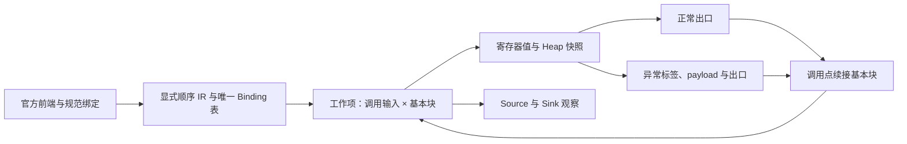

# 核心语义链架构验证（2026-09-22）

> 2026-09-22 路线复核：本页保留原型语义与成本证据；执行优先级已调整为先验证当前 MoonBit 语义入口，再贯通真实安全链，最后优化成本并裁决迁移。下面旧 B 阶段不再表示当前排期。当前决策见 [基础设施与组件取舍](moonbit-infrastructure-research-2026-09-22.md)。

## 决定与当前结论

**停止沿现有 AST 污点扫描器继续扩展能力，先验证独立核心。当前只通过 IR 语义规格阶段，尚未通过生产迁移验收。**

保留已验证的解析器、规则配置、合法语料、告警断言和工具链迁移成果。已有 AST 字段补丁保留在工作区作为对照，不再作为后续架构的基础，也不回滚用户的其他修改。

原型位于 [experiments/core_semantics](../experiments/core_semantics/README.md)。它使用 Python 标准库表达可执行语义规格，目的是审查状态、调用和依赖关系；**没有接入 MoonBit 前端，不能将其耗时当作 MoonBit 生产核心的性能**。后续生产实现仍需在项目工具链中验收。

当前证据：

- 15 个手写 IR 见证涵盖必然/可能别名、顺序覆盖、返回值捕获、正常/异常堆、异常 payload 对象、递归和工厂对象隔离。
- 256 个固定种子生成的顺序读写程序，与独立具体执行器得到完全一致的污点观察结果。
- 14 项测试通过，包含缓存绑定/指令顺序失效、输入不可变、预算耗尽保守状态和基本块工作队列成本。
- 原扫描器的“多形参别名先写后读漏报”和“后写清理误报”，在对应的 IR 见证中得到正确结果。**原 MoonBit CLI 反例尚未自动经过新核心，因此不能记作生产问题已经关闭。**

机器记录：[core-semantics-validation-2026-09-22.json](metrics/core-semantics-validation-2026-09-22.json)。以上对照覆盖有限具体执行轨迹及生成的顺序程序，不是对全部程序的正确性证明。

## 一、唯一语义来源

| 事实 | 唯一来源及不变量 | 原型现状 |
| --- | --- | --- |
| 函数与声明身份 | 绑定阶段产生规范 FunctionId、函数内寄存器 ID；展示名称不参与补猜目标 | 输入 IR 显式提供身份；生产绑定器适配待实现 |
| 对象身份 | `(AllocationSiteId, 最近一层 CallSiteId)`；同一抽象位置多次分配标为 many | 已实现；many 对象只能弱更新，防止错误清除旧对象的污点 |
| 调用绑定 | 每个 Invoke 对应唯一 Binding 行，完整列出被调函数和形参→实参寄存器映射 | 已实现；缺目标、缺形参、重复调用点都拒绝 |
| 堆状态 | 每条路径只有一种 Heap 表示，对象引用用于定位字段；值来源不用于推断别名 | 已实现；分支保存快照，在汇合点合并，不能共用一份可变全局堆污染分支 |
| 返回与异常 | 出口携带返回值/异常 payload 和同一 Heap；调用继续使用该出口的堆 | 已实现；正常出口和各异常标签分开 |
| 来源事实 | 固定 IR SourceId 的有限集合，不再生成 `param.a.b.c…` 符号路径 | 已实现 |

这里的“唯一堆”指唯一语义表示和更新规则，不是让所有控制流路径共享可变对象。返回、字段和异常消费者不维护自己的第二套污点堆。



图中的前端适配尚未实现。原型不导入现有 AST 扫描器、字段摘要或回退逻辑。

## 二、保留读写依赖的表示

核心执行 `Alloc / Copy / Load / Store / Branch / Invoke / Return / Raise / Source / Sink`。顺序来自基本块中的指令数组，异常后继来自 Invoke；消费者不能重新猜测求值顺序。

例如：

```text
Store first.value, dirty
r = Load second.value
Store second.safe, r
```

调用 `fill(box, box)` 时，两个形参引用同一个 ObjectId，第二条指令读取第一条写入后的值。调用 `fill(a, b)` 时，对象身份不同，读取 b 的原值。后续 clean 写入按同一条 Store 语义覆盖；不需要专门识别“两个形参同名”或 Map 遍历顺序。

调用输入键为 `(FunctionId, CallSiteId, actual values, input heap)`。当前保存的是给定输入状态下求得的出口结果，**不把各形参的独立最终字段值作为通用变换式再拼接**。这能表达别名敏感的顺序读写，但全堆进入输入键也带来明确的成本问题，见第四节。

## 三、递归、不动点和预算

对有效且处于当前 IR 范围内的程序，以下集合固定且有限：函数、调用点、分配点、字段、寄存器、布尔值、SourceId，加上有限的入口对象/来源事实。对象上下文深度固定为一层；值为有限来源/引用/布尔集合，分配多重性只有 single/many。

因此，调用输入状态、基本块状态和出口状态空间是有限的。工作队列按 join 单调累积节点和出口；被调方出口增加时，只唤醒依赖它的调用基本块。递归没有调用栈深度截断，也不会增加新的字段路径字符串。这里的论证依赖 IR 契约和传递函数的单调性，当前没有机械化证明，状态空间有限也不等于现实成本可接受。

递归见证实际出现自依赖，3 个调用输入实例经重算到达不动点。`fixed_point` 表示分析收敛，不表示被分析程序一定终止。

预算为传递次数、调用输入实例数量和协作式时间检查。耗尽时：

- 返回 `incomplete_budget`，不能返回 `fixed_point`。
- 保留正常和未知异常出口；返回值、所有可能对象字段置为未知。
- 覆盖输入对象与未来分配对象，并将未访问的已知 sink 计入可能告警；不缓存此结果。
- 时间检查发生在指令边界，不能替代生产进程的硬超时监管。

未支持的 IR 指令或不完整绑定直接拒绝；不调用 AST 回退，也不能把拒绝解释为安全分析成功。

## 四、成本验证及尚未解决的问题

原型最初按函数整体重算，128 次串联调用执行了 8,771 次传递。现已改为 `(调用输入, 基本块)` 工作项，只重算受影响的调用点。

当前记录启用了 Python 内存跟踪，耗时只用于本规格内部比较：

| 串联调用 | 活跃对象 | 传递次数 | Python 跟踪峰值 | 耗时 |
| --- | --- | --- | --- | --- |
| 8 | 0 | 27 | 约 10 KB | 约 0.0006 s |
| 32 | 0 | 99 | 约 36 KB | 约 0.0021 s |
| 128 | 0 | 387 | 约 151 KB | 约 0.0082 s |
| 8 | 8 | 51 | 约 20 KB | 约 0.0015 s |
| 32 | 32 | 195 | 约 217 KB | 约 0.015 s |
| 128 | 128 | 771 | 约 2.4 MB | 约 0.203 s |

传递次数门禁已通过，**堆快照的存储与哈希成本仍增长过快**。当前采用全堆输入键和直接快照，需要验证结构共享、增量哈希及必要的依赖划分。不能仅把无关字段从缓存键删除：必须证明不会漏掉别名、返回对象、异常和重复分配位置的影响。

真实 MoonBit 语料尚未进入这个核心。“15 个见证很快”不构成真实语料性能证据，也不能用减少扫描覆盖面换取与旧扫描器的耗时对比。

## 五、后续执行顺序和淘汰标准

### B1：先解决状态成本

采用共享结构存储 Heap/寄存器快照，保持现有可执行语义与具体执行对照。增加 512、2,048 个对象的调用链与递归堆变化压测，记录时间、峰值内存、输入实例数量及预算状态。对于确定性的顺序程序，传递次数应随指令数线性增长；状态表示不能靠重算整个调用者控制成本。

若需要减少输入状态区分，先给出对别名和效果依赖的保守规则，并验证损失的精度；不以少报作为优化成功。

### B2：建立受限的 MoonBit → IR 适配

复用官方 parser 和规范身份/绑定的可用部分，适配只做显式语法降低，不执行污点推断。范围先固定为本轮对象、赋值、顺序调用、布尔分支、return、raise/catch 所需语法；默认值、defer、泛型派发等能力不同时扩张。

至少让两个现有别名失败反例及对应安全/异常/工厂对照通过真实编译，再经该适配进入新核心。每项必须能追溯到源位置和 IR 指令；不支持项显式拒绝。删除旧 AST 求值结果后，结果必须不变。

### B3：真实语料与迁移裁决

在固定版本、相同分析覆盖面和预算下比较冷/热扫描、耗时、峰值内存、完整性及告警位置。先保留已知递归热点用于诊断，再执行完整语料门禁；热点切片通过不能代替整库验收。mocket/crescent 的历史编译兼容问题仍需单独记录或固定兼容版本。

**同时满足以下条件，才逐步迁移生产入口：**

1. 已列语义正反例经真实 MoonBit 适配全部通过，字段/返回/异常消费同一状态。
2. 递归不动点、预算保守处理、调用绑定变化及效果顺序的缓存失效通过。
3. 固定真实语料成本和分析覆盖面达到预先约定的门禁；没有隐藏回退或静默截断。

如果 B1/B2 必须读取 AST 预计算污点、借用第二份堆、添加例子专用分支才能通过，就淘汰该实现，继续替换核心求解层。若只是前端缺少明确的语法降低规则，应作为适配未完成报告，不能混淆为核心语义已证明或必然失败。

当前裁决：**核心表示可继续验证，生产迁移暂不通过；先做状态成本和真实前端接入，不恢复外围能力扩张。**

## 2026-09-23 后续状态

已有[受限 MoonBit 源码适配实验](../experiments/frontend_adapter/README.md)把五组编译通过的别名、字段顺序及遮蔽对照自动降低为本规格 IR；这是固定版本、小语法子集的证据。本文原有手写 IR、生成程序和资源测量仍保留其原本范围。异常、递归源码、真实 CWE-113 API 和生产迁移条件尚未通过。
