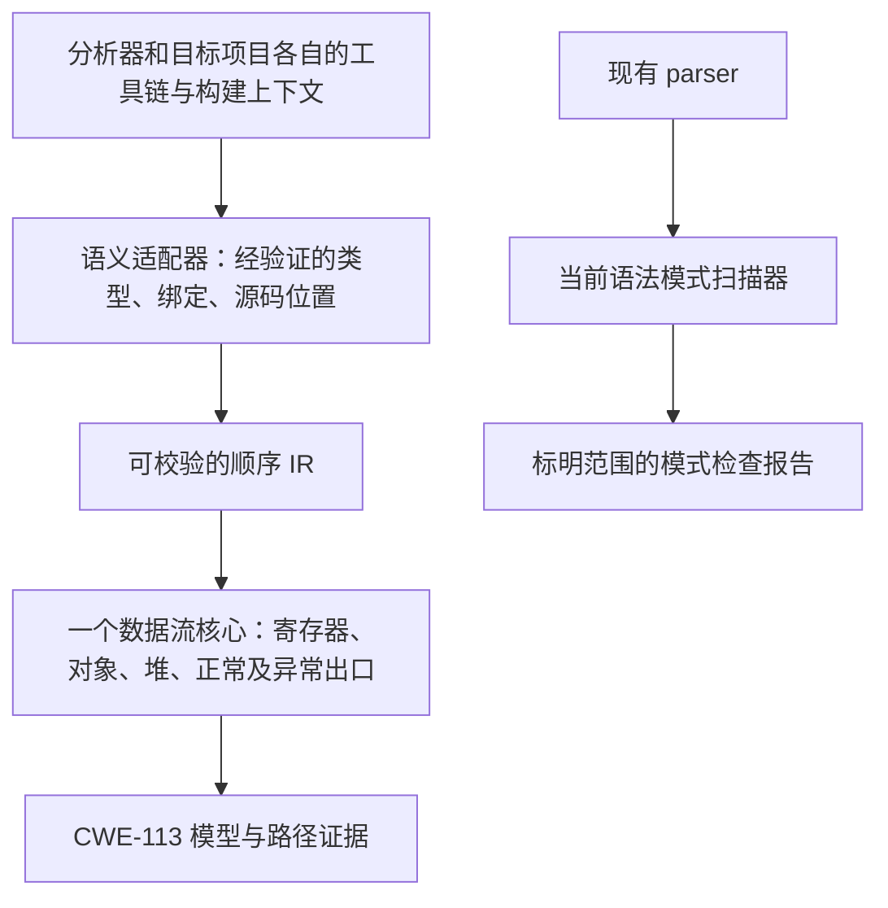

# 精简落地与核心重设计（2026-09-22）

> 2026-09-23：用户已确认“保留有限扫描器，独立重建核心”。[G0 实测进展](frontend-contract-2026-09-23.md)已落档；新核心尚未具备生产输入契约。

## 决策

采用**选择性删减**，保留一个可构建、范围明确的语法模式扫描器。Git HEAD 不移动；没有执行 reset 或改写历史。参考边界是 `1def569`（引入跨函数分析之前），保留当前版本中已验证的解析、规则、报告、baseline 和 CLI 错误处理。

直接回退 `1def569` 会带回旧解析接口、隐式错误处理和旧 CLI；回退到 `bef96e2` 则仍携带跨函数摘要。两者都不能直接充当新核心基础，因此只复用早期规则分发边界。

本次实际缩减：`src/**/*.mbt` **96 → 28 个文件，37,401 → 4,330 行，减少约 88.4%**，含测试、不含生成接口。这里衡量的是活动源码规模，不是准确率、性能或完成度。具体删除清单见 [机器记录](metrics/reduction-2026-09-22.json)。

## 1. 保留、移除和行为变化

| 范围 | 当前状态 |
| --- | --- |
| 官方 parser、双解析入口、插值位置处理 | 保留当前实现及其测试；只供模式匹配使用，不产生类型/调用图事实。 |
| 14 条语法模式规则及公共类型/辅助函数 | 保留；CWE-113 改为低置信度动态头部值检查，不判断输入来源或净化效果。 |
| JSON、SARIF、文本报告 | 保留；全部披露 `engine=syntax-pattern` 和跨函数/类型/净化解析缺失；SARIF 另记录执行是否完整。 |
| baseline、文件列表扫描、规则选择、失败退出 | 保留已验证行为；空文件列表扫描零文件，解析失败不覆盖 baseline。文件列表扫描不意味着依赖增量分析。 |
| 旧类型重建、HIR/CFG 双执行、指针/调用图、联合求解器、摘要、字段/默认值/异常补丁、缓存、分析注册表 | 从当前 `src` 删除，完整内容保存在本地快照。 |
| LLM、PoC、修复建议脚本生成、pipeline、框架观测子命令 | 从当前 CLI 和源码删除，降低当前交付的维护范围。 |
| 新核心 Python 规格 | 留在 `experiments/core_semantics`，不进入生产扫描；其原有正确性/成本限制不变。 |
| 旧 CLI 全套回归、真实反例、语料和研究记录 | 保留。CLI 原套件归档到 `docs/legacy`；`tests/cases` 与 `docs/review-fixtures` 保持原预期。它们不能拿新模式扫描器的结果作通过证明。 |

移除的选项包括 `--cfg-engine`、`--cfg-verify`、`--mode`、`--context-strategy` 等；旧污点 DSL 配置明确报错。不会因请求了旧引擎而静默改用模式扫描。`CWE-116/tainted-output` 依赖旧污点核心，不在当前 14 条规则内。

版本标为 **0.5.0-dev**，用于区分缩减后的不兼容开发状态；未发布。既有 GitHub Action 依赖的普通扫描、输出、严重性筛选仍保留。旧公开库 API 已发生大量删除，现有库调用方需要适配。

## 2. 新核心架构：四个边界



上半部分已有[受限真实源码适配实验](../experiments/frontend_adapter/README.md)，但仍未通过完整安全链验收，也尚无 MoonBit 生产实现。下半部分已经运行。二者独立，不允许新核心读取模式扫描器的污点、摘要或推测类型，也不允许未支持语义回退后伪装成新核心的完整结果。

### A. 语义适配器：负责交付事实，不负责推断漏洞

先复用 `moon` 的实际包、目标后端、源码及依赖上下文。优先验证当前工具链可消费的语义接口；IDE 查询只能在已实测的范围内使用。公开 compiler 源码与发行版匹配关系尚未建立，不能先写一个依赖旧 Core 布局的生产读取器。

适配器输出必须带 producer/toolchain/backend/schema/source 指纹，并为以下内容提供可追溯来源：

- 函数、参数、局部变量、字段与类型的规范身份，独立于展示名称。
- 调用表达式的实际求值顺序、形参与实参对应关系、明确目标或明确未知目标。
- 字段读写、对象分配、分支、返回及异常控制流的源码位置。
- 未支持构造及其影响范围；不能把“查询不到”编码成空目标集合或干净值。

**G0 的第一交付是该契约的真实数据文件和产生它的命令。** 不能只有结构定义、接口名字或手写 JSON。详见 [基础设施调研](moonbit-infrastructure-research-2026-09-22.md)。

### B. 顺序 IR：只接受核心能执行的操作

初始操作集为 `Alloc / Copy / Load / Store / Branch / Invoke / Return / Raise / Source / Sink`，带基本块后继。API source/sink 标记来自明确模型身份；不能仅凭源代码函数短名标记。默认参数、trait、闭包等若未正确降低，应在入口显式拒绝或记录不完整。

每个调用点只有一份绑定记录。所有模块共享同一批 FunctionId、VariableId、FieldId、AllocationSiteId、CallSiteId；类型事实属于适配结果，不在求解器或规则里补猜。

### C. 数据流核心：只有一套状态语义

- 状态由寄存器值、对象引用和 Heap 构成；正常与异常出口均携带同一种 Heap 表示。
- 字段读取必须使用该程序点之前的堆状态；两个形参指向同一对象时，写入影响后续另一形参读取。
- 只有确定单一实例的更新可以覆盖旧值；可能别名或多实例抽象进行保守合并。
- 工作队列根据依赖增量调度。第一版固定一种对象/上下文策略，不提供多种策略选项。
- 递归在有限抽象域求不动点；预算耗尽产生显式不完整与未知效果，不能把未访问路径算安全。

Python 规格已能验证部分上述语义，仍存在全输入堆快照成本。先接通真实输入再评估存储实现，不先建设通用插件、生产缓存或可扩展框架。

### D. 模型和结果：围绕一个漏洞链验收

第一条目标链为 CWE-113：输入 → helper → 可变字段 → helper/返回或错误出口 → header sink；同时测试净化、安全常量、同名普通函数和不同对象对照。

未来分析结果至少包含分析状态、支持范围、未知原因、来源/传播/汇聚位置和采用的模型。状态区分“约定范围内收敛”“语义未支持”“预算耗尽”“输入失败”。当前模式报告里的“扫描结束”不等于未来核心对该安全链已经分析完整。

## 3. 分阶段停止条件

| 阶段 | 可审查交付 | 不通过时如何处理 |
| --- | --- | --- |
| G0，建议最多 3 个工作日 | 当前工具链的语义契约、真实编译探针、事实来源与成本 | 不扩大核心；继续交付有限模式检查，记录缺失入口。不能自动改为自建完整类型系统。 |
| G1，真实安全链 | 原 `.mbt` 自动降低并执行；别名顺序、清理、返回、异常、递归的正负对照 | 输入不完整则退回适配器；需要旧 AST 摘要、第二套堆或例子特判则淘汰实现。 |
| G2，资源和覆盖面 | 固定语料的支持分母、告警对照、含前端的耗时与内存 | 优化实际瓶颈或缩小已承诺范围；不能靠跳过文件达到性能指标。 |

G2 初始建议预算仍为单项目 60 秒/1 GiB，尚未验证。先证明已承诺安全链及其依赖完整覆盖，再迁移这一范围。冷/热缓存只在以后真正引入生产缓存时验收。

**不再以 Tai-e 全功能、组件数量、Java 语料指标或测试总数作为完成条件。** Tai-e 的 IR、依赖传播、对象抽象和规则模型是设计参考；其 Java 运行时适配、多上下文选择与插件生态不进入第一版目标。

## 4. 验证与历史测试的区别

当前最终工作区通过四后端各 66 项 MoonBit 测试，CLI 14 项集成回归；10 项沿用保留功能的旧用例，4 项覆盖缩减后的显式边界。保留的规则、解析和 baseline 测试继续执行。

旧的 437 项/后端和 61 项 CLI 结果属于删减前流水线，不能与当前数量拼接或宣称“全部能力仍通过”。旧跨函数反例预期没有降低；它们现在是后续 G1 的需求和对照。CI 不再执行旧语义套件作为当前扫描器的门禁，而是分别运行有限扫描器测试与独立 IR 规格测试。

`tests/harness/test_harnesses.py` 使用假工具验证脚本的错误处理；其通过只证明脚本机制，不能证明当前扫描器仍支持旧 call-graph/ir-stats。

## 5. 恢复方式

删减前的所有 Git 已跟踪文件和未忽略的新文件已经保存并逐文件 SHA-256 校验：

- `.recovery/2026-09-22-before-redesign/workspace.tar.gz`
- 同目录 `manifest.json`、`HEAD`、`unstaged.patch`、`staged.patch`、`status.txt`

`.recovery` 被 Git 忽略，是本机恢复点，不会随提交上传；请保留此目录。原有被忽略的 `.env`、依赖、构建物不在归档内，本次没有修改它们。

推荐恢复到独立目录作对照，避免覆盖当前工作：

```bash
mkdir -p /tmp/moon-audit-before-redesign
# 从项目根目录执行；仅在空的对照目录中解包。
tar -xzf .recovery/2026-09-22-before-redesign/workspace.tar.gz -C /tmp/moon-audit-before-redesign
```

这会恢复文件内容；当前 Git HEAD 和 index 从未被重置。
